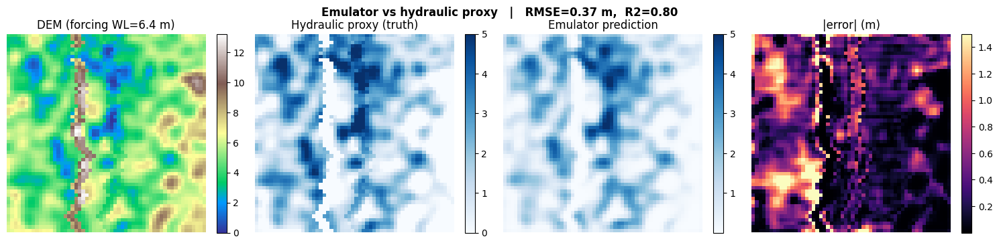
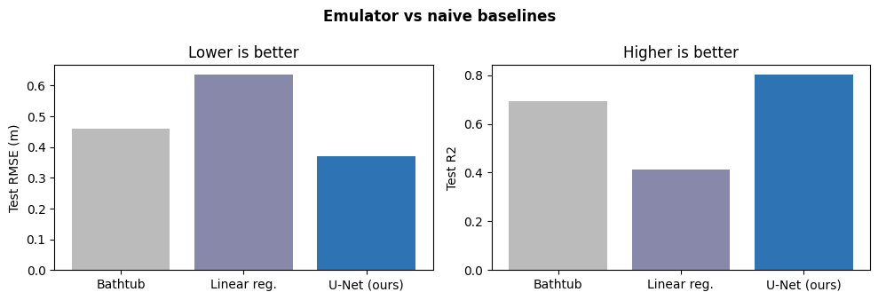
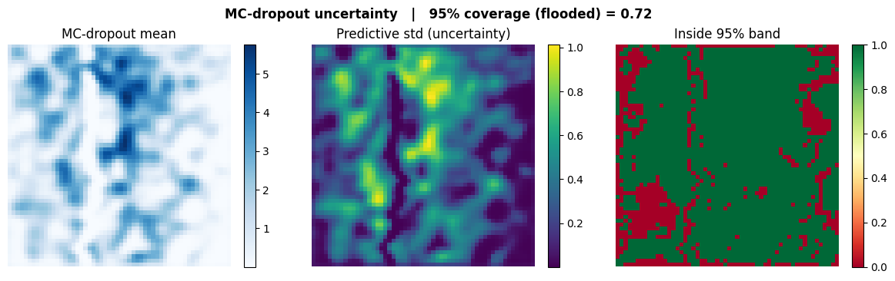
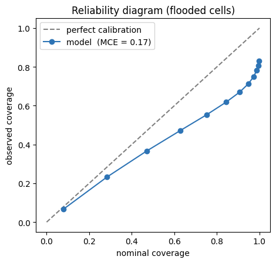
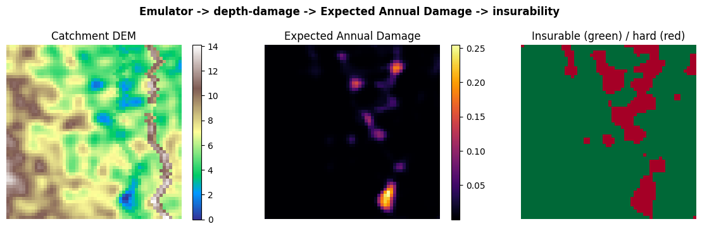

# AI-Driven Flood Scenarios & Insurability — a methods demonstrator

A small, self-contained proof of concept built as a demonstrator for the **UvA / FIRM Pillar 3**
PhD position *"AI-Driven Flood Scenarios and Insurability Maps."*

It is **not** a solved research problem and makes no scientific claims. It exists to show, in runnable
code, how I would approach the building blocks the project describes — and to be honest about where the
toy setup ends and the real project begins.

## What it shows

| Pillar 3 task | In this repo |
|---|---|
| A fast surrogate for hydraulic flood scenarios | A **U-Net emulator** learns depth maps from *(terrain, boundary water level)* |
| The surrogate must add real value | **Baseline comparison** vs a naive bathtub `relu(h−z)` and a linear model — the U-Net wins because of levee/connectivity effects the baselines can't represent |
| Probabilistic impact representation | **MC-dropout** uncertainty **+ a reliability diagram** (honest calibration check) |
| Spatial data & non-linear connectivity | Raster-based; the "truth" includes a **levee with a breach** protecting a low polder — a non-linearity a bathtub model misses |
| Rapid damage & insurability | emulator → depth-damage curve → **Expected Annual Damage** → insurability map |

Representative results on synthetic test data: the emulator reaches **R² ≈ 0.80 / RMSE ≈ 0.37 m** on a
deliberately hard levee-and-breach task, **cutting RMSE ~20% vs the bathtub baseline and ~40% vs linear
regression**. The reliability diagram shows MC-dropout is mildly **over-confident** (miscalibration ≈ 0.17)
— shown plainly rather than hidden. (All numbers depend on the seed and are only meaningful inside the toy setup.)







## Run it

```bash
pip install -r requirements.txt
jupyter notebook flood_emulator_demonstrator.ipynb
```

Runs top-to-bottom on a laptop **CPU** in a few minutes (seconds on a GPU). Fixed seeds throughout.

## Honest scope

The "hydraulic model" is a cheap **flood-fill proxy** (with a synthetic levee/breach), not a solver; the
depth-damage curve, asset grid, and return-period→forcing mapping are stylised; and a single test
catchment is not a validation study. The value is the **methodology and the end-to-end wiring**, plus the
baseline and calibration checks — not the hydrology.

Each toy component maps to a real input in the actual project:

| Toy component | Real counterpart |
|---|---|
| Synthetic DEM + levee | Copernicus DEM / AHN (Netherlands); real defence lines |
| Flood-fill proxy | Existing hydraulic scenario sets |
| Random forcing | Sea/river levels & discharges with exceedance probabilities |
| Fixed depth-damage curve | JRC / sector depth-damage functions; insurance claims data |
| Return-period sweep | KNMI'23 + IPCC climate scenarios per horizon year |

## Where I'd take it next
- Deep ensembles / quantile regression instead of MC-dropout (the reliability diagram already shows why), with proper CRPS/calibration reporting.
- **Generating** credible extreme scenarios beyond the historical range (conditional generative models) — the genuinely novel ask.
- Explicit **breach-growth and defence-failure** uncertainty (dominates tail risk).
- Validation across **data-rich (NL)** and **data-scarce** regions; integration with Pillars 1–2.

---
*Author: Sahar Mirzabaki. Built as a personal demonstrator; not affiliated with UvA or the FIRM consortium.*
